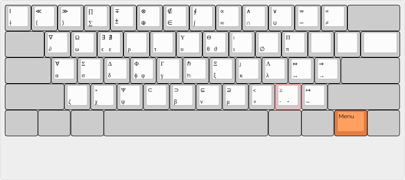

# Efficient LaTeX typing

LaTeX (and LaTeX-like) is the "official language" for complex scientific documents. Quite often it is also used by scientist to take notes about their ongoing projects and also to do actual computations. For these purposes the faster one can type the better it is. Here we propose a keyboard mapping for Linux (using Xorg) that makes particularly easy and painless to type greek letters and maths symbol:

* Typing UTF8 symbols like `α`, `∂`, `∫` instead of `\alpha`, `\partial`, `\int` directly in your `.tex` file you will save a lot of keystokes;

* Moreover your source file will be much more human readable and it will be easier to perform computation directly on it. 

