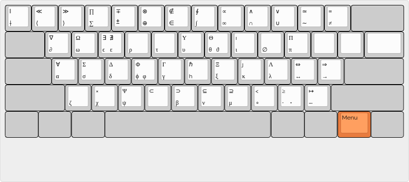

# Efficient `LaTeX` typing

`LaTeX` (and `LaTeX`-like) is the "official language" for complex scientific documents. Quite often it is also used by scientists to take notes about their ongoing projects and to do actual computations. For these purposes the faster one can type the better it is. Here we propose a keyboard mapping for Linux (using Xorg, but for Wayland should work as well) that makes particularly easy and painless to type greek letters and maths symbol:

* Typing UTF8 symbols like `α`, `∂`, `∫` instead of `\alpha`, `\partial`, `\int` directly in your `.tex` file you will save a lot of keystokes;

* Moreover your source file will be much more human readable and it will be easier to perform computation directly on it. 

## `LaTeX` keyboard layout

Based on `us` layout (with `altgr-intl` variant, which allow right `altgr` to be a compose key) one can use the `menu` key as a further modifier to access another layer of symbols (see picture). I made the choice of `menu` key because it is the most useless key that sits among other modifier keys. Another candidate would be right `windows` key.



All you need to do is to copy the [latex_us](latex_US) to your Xorg symbols directory: typically `/usr/share/X11/xkb/symbols/latex_US` . The you have to select the keyboard layout. This can be done with

```
setxkbmap latex_US
```

Some comments:

* I avoid filling every single key with some symbol. I try to maintain the layout clean and easy to remember. If you want to add something just look at the [latex_us](latex_US), it is easy to understand and modify.

* You may want to select a key other than `menu` as modifier (if for instance on a laptop you do not have it or you simply prefer another key): you have just to modify the second to the last line of the above file.


## `LaTeX` and `XeLaTeX` setting

To directly type math in source one needs a minimal preamble both in LaTeX and XeLaTeX. My suggestion is to use XeLaTeX if you can since it natively supports UTF8.

### `LaTeX` preamble

You should use `utf8x` as option of `inputenc` package (however this choice is not compatible with some modern packages like `biblatex`). A Minimal preamble is the following

```latex
\usepackage[utf8x]{inputenc}
\SetUnicodeOption{mathletters}
\SetUnicodeOption{autogenerated}
```

We point out that:
* for some reason not all UTF8 character can be parsed: an example is `•`, that is `\bullet`;
* in principle one can use also UTF8 character in label, but is not a good practice (since `\` is not allowed instead).

### `XeLaTeX` preamble

In order to use `XeLaTeX` (and also `LuaLaTeX`) one needs only to load

```latex
\usepackage{unicode-math}
```

in the preabme *after* the various AMS packages.


## Convert from UTF8 to traditional `LaTeX` form

Even if you type your paper or your note using UTF8 symbols it can happen that you have to share the file with other people which may want to have good old almost-ASCII source. For this purpose you can use [this script](utf8tolatex.py) written in `python 3`. It takes the source code written with UTF8 as input and it translate it into a good-old traditional `LaTeX` source file:

```
python utf8tolatex [-h] infile [outfile]
```

clearly `-h` print tells you the usage, `infile` is the input file and `outfile` is the output file; if omitted the script will print the output on `stdout`.


## Examples

In the [example directory](examples) you will see some example sources:

* `latex_utf8.tex` is written using UTF8 keyboard (compile it using `pdflatex`)
* `latex_ascii.tex` has been produced by the script (compile it using `pdflatex`)
* `xelatex_utf8.tex` is written using UTF8 keyboard (compile it using `xelatex`)
* `xelatex_ascii.tex` has been produced by the script (compile it using `xelatex`)